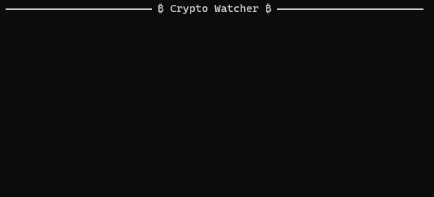
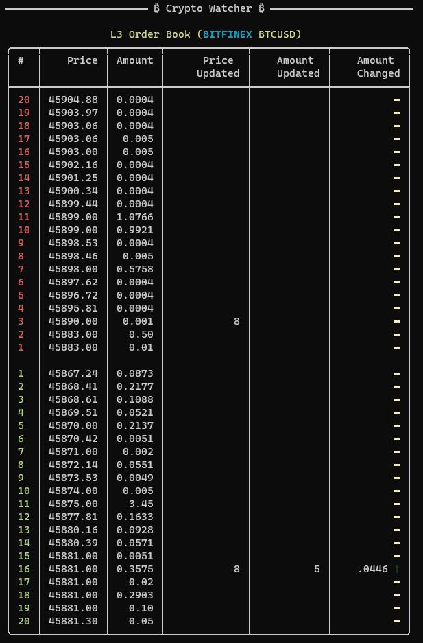

# Cryptocurrency Watcher

This sample console application presents possibilities of [crypto-websocket-extensions](https://github.com/Marfusios/crypto-websocket-extensions) library. 

* displaying real-time price changes (under 1ms)
* displaying L3 order book with reporting about price/amount updates of the individual orders

Price changes: 



L3 order book: 



Once cloned, run the following from a command line to run the app.

``` console
> dotnet restore
> dotnet run
```

You can modify the settings in [appsettings.json](./appsettings.json) to add or remove exchanges and symbols 
you'd like to watch.
Also you can change mode between `PriceChanges` and `L3`. 

After that, you're off to the moon. 🚀💎🙌

Inspired by: [StonksWatcher](https://github.com/khalidabuhakmeh/StonksWatcher)